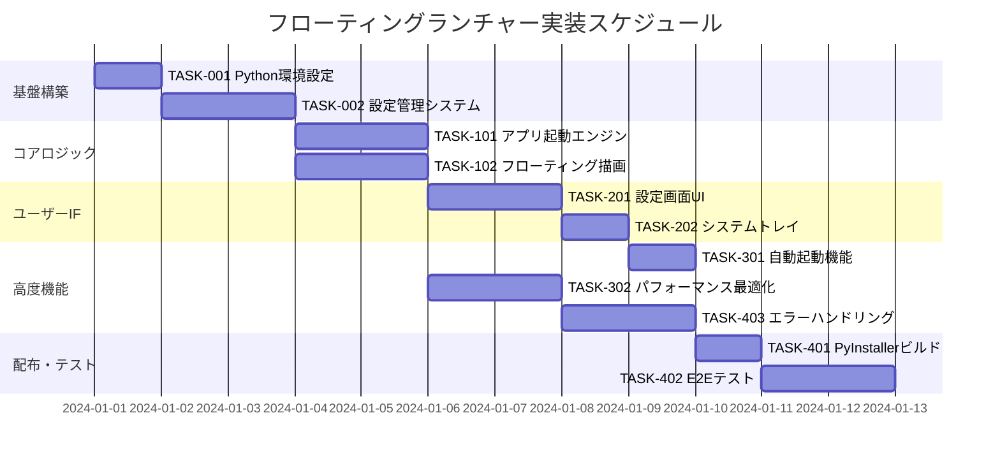

# フローティングアイコンランチャー 実装タスク

## 概要

全タスク数: 12
推定作業時間: 16時間
クリティカルパス: TASK-001 → TASK-002 → TASK-101 → TASK-201 → TASK-301

## タスク一覧

### フェーズ1: 基盤構築

#### TASK-001: Python開発環境初期設定

- [x] **タスク完了**
- **タスクタイプ**: DIRECT
- **要件リンク**: REQ-005, REQ-006
- **依存タスク**: なし
- **実装詳細**:
  - Python 3.8以降のインストール確認
  - requirements.txt作成（tkinter, PyInstaller等）
  - 仮想環境セットアップ
  - ディレクトリ構成の作成
- **テスト要件**:
  - [ ] Python環境動作確認テスト
  - [ ] 仮想環境アクティベーション確認
  - [ ] tkinter importテスト
- **完了条件**:
  - [ ] Python 3.8以降が使用可能
  - [ ] 必要ライブラリがインストール済み
  - [ ] プロジェクト構成ディレクトリが作成済み

#### TASK-002: 設定ファイル管理システム

- [x] **タスク完了**
- **タスクタイプ**: TDD
- **要件リンク**: REQ-004, REQ-202, NFR-102
- **依存タスク**: TASK-001
- **実装詳細**:
  - JSONベース設定ファイル読み書きクラス
  - 設定値のバリデーション機能
  - デフォルト設定の自動生成
  - 設定ファイル破損時の復旧処理
- **テスト要件**:
  - [ ] 単体テスト: 設定ファイル読み書きロジック
  - [ ] 単体テスト: バリデーション処理
  - [ ] 統合テスト: 破損ファイル復旧処理
- **エラーハンドリング**:
  - [ ] JSONパースエラー処理
  - [ ] ファイル権限エラー処理
  - [ ] 無効な設定値の処理
- **完了条件**:
  - [ ] 設定ファイルが正常に読み書きできる
  - [ ] 破損時の自動復旧が動作する
  - [ ] 全テストがパスする

### フェーズ2: コアロジック実装

#### TASK-101: アプリケーション起動エンジン

- [x] **タスク完了**
- **タスクタイプ**: TDD
- **要件リンク**: REQ-002, REQ-103, REQ-104, NFR-002, NFR-101
- **依存タスク**: TASK-002
- **実装詳細**:
  - subprocess を使用したアプリケーション起動機能
  - ファイル存在チェック・セキュリティ検証
  - 管理者権限要求処理
  - 起動エラーハンドリング
  - 重複起動検知（オプション）
- **テスト要件**:
  - [ ] 単体テスト: 正常なアプリケーション起動
  - [ ] 単体テスト: 存在しないファイルの処理
  - [ ] 単体テスト: 権限不足時の処理
  - [ ] パフォーマンステスト: 1秒以内の起動
- **セキュリティ要件**:
  - [ ] 悪意のあるパスの検証と拒否
  - [ ] 実行ファイル以外の拒否
  - [ ] 相対パスの絶対パス変換
- **完了条件**:
  - [ ] アプリケーションが正常に起動される
  - [ ] セキュリティ検証が正しく動作する
  - [ ] エラー処理が適切に機能する

#### TASK-102: フローティングアイコン描画エンジン

- [ ] **タスク完了**
- **タスクタイプ**: TDD
- **要件リンク**: REQ-001, REQ-003, REQ-201, NFR-004, NFR-201, NFR-302
- **依存タスク**: TASK-002
- **実装詳細**:
  - tkinter Toplevelを使用した常時前面表示ウィンドウ
  - カスタムアイコン描画機能
  - 高DPI対応のスケーリング
  - 複数モニター対応
  - 透明背景とクリックスルー防止
- **テスト要件**:
  - [ ] 単体テスト: ウィンドウ表示・非表示
  - [ ] 単体テスト: 前面表示維持
  - [ ] 統合テスト: 高DPI環境での表示
  - [ ] パフォーマンステスト: 60FPS描画更新
- **UI/UX要件**:
  - [ ] 視認性: 明確な境界線とシャドウ
  - [ ] レスポンシブ: クリック時の視覚フィードバック
  - [ ] アクセシビリティ: 高コントラスト対応
- **完了条件**:
  - [ ] フローティングアイコンが常時表示される
  - [ ] 高DPI環境で正常にスケールされる
  - [ ] 描画パフォーマンスが要件を満たす

### フェーズ3: ユーザーインターフェース

#### TASK-201: 設定画面UI

- [ ] **タスク完了**
- **タスクタイプ**: TDD
- **要件リンク**: REQ-102, REQ-202, NFR-202, NFR-204
- **依存タスク**: TASK-002
- **実装詳細**:
  - tkinterベースの設定ダイアログ
  - アプリケーションパス選択機能（ファイルダイアログ）
  - アイコン位置設定（座標指定・ドラッグ移動）
  - 自動起動設定
  - 設定の保存・適用・キャンセル機能
- **テスト要件**:
  - [ ] 単体テスト: 各設定項目の入力検証
  - [ ] 単体テスト: ファイルパス選択処理
  - [ ] 統合テスト: 設定保存・読み込み
  - [ ] E2Eテスト: 設定変更の反映確認
- **UI/UX要件**:
  - [ ] ユーザビリティ: 直感的なレイアウト
  - [ ] エラー表示: バリデーションメッセージ
  - [ ] アクセシビリティ: Tab順序とキーボード操作
  - [ ] 入力支援: プレースホルダーとヒント表示
- **完了条件**:
  - [ ] すべての設定項目が正しく動作する
  - [ ] 設定変更がリアルタイムで反映される
  - [ ] UIが直感的で使いやすい

#### TASK-202: システムトレイ統合

- [ ] **タスク完了**
- **タスクタイプ**: TDD
- **要件リンク**: REQ-203, NFR-203
- **依存タスク**: TASK-201
- **実装詳細**:
  - Windows システムトレイアイコンの表示
  - 右クリックメニュー（設定・終了）
  - アプリケーション終了処理
  - バックグラウンド動作サポート
- **テスト要件**:
  - [ ] 単体テスト: トレイアイコン表示・非表示
  - [ ] 単体テスト: メニュー項目クリック処理
  - [ ] 統合テスト: 安全な終了処理
- **UI/UX要件**:
  - [ ] アイコン: 認識しやすいデザイン
  - [ ] メニュー: 標準的なWindowsアプリと同様の操作感
  - [ ] 終了処理: 設定保存と安全なリソース開放
- **完了条件**:
  - [ ] システムトレイから操作できる
  - [ ] 安全にアプリケーションを終了できる
  - [ ] バックグラウンドで正常に動作する

### フェーズ4: 高度機能・最適化

#### TASK-301: 自動起動機能

- [ ] **タスク完了**
- **タスクタイプ**: TDD
- **要件リンク**: NFR-204
- **依存タスク**: TASK-202
- **実装詳細**:
  - Windows レジストリまたはスタートアップフォルダへの登録
  - 起動時設定の有効化・無効化
  - exe化対応の起動パス設定
- **テスト要件**:
  - [ ] 単体テスト: レジストリ操作処理
  - [ ] 統合テスト: Windows起動時の自動実行
  - [ ] 手動テスト: 設定のON/OFF切り替え
- **セキュリティ要件**:
  - [ ] レジストリアクセス権限の確認
  - [ ] 正当な実行ファイルパスの設定
- **完了条件**:
  - [ ] Windows起動時に自動で実行される
  - [ ] 設定から自動起動のON/OFFができる
  - [ ] セキュリティ要件を満たしている

#### TASK-302: パフォーマンス最適化

- [ ] **タスク完了**
- **タスクタイプ**: TDD
- **要件リンク**: NFR-001, NFR-002, NFR-003, REQ-402
- **依存タスク**: TASK-101, TASK-102
- **実装詳細**:
  - メモリ使用量の最適化
  - CPU使用率の削減
  - 起動時間の短縮
  - 描画処理の効率化
- **テスト要件**:
  - [ ] パフォーマンステスト: 起動時間3秒以内
  - [ ] パフォーマンステスト: アプリ起動1秒以内
  - [ ] パフォーマンステスト: CPU使用率0.1%以下
  - [ ] パフォーマンステスト: メモリ使用量50MB以下
- **最適化項目**:
  - [ ] 不要なライブラリのインポート削減
  - [ ] イベントループの効率化
  - [ ] メモリリークの防止
- **完了条件**:
  - [ ] 全てのパフォーマンス要件を満たす
  - [ ] 長時間稼働でも安定している
  - [ ] システムリソースを効率的に使用している

### フェーズ5: 配布・テスト

#### TASK-401: PyInstaller設定とビルドシステム

- [ ] **タスク完了**
- **タスクタイプ**: DIRECT
- **要件リンク**: REQ-006, REQ-404
- **依存タスク**: TASK-302
- **実装詳細**:
  - PyInstallerの設定ファイル作成
  - 単一exeファイル化設定
  - アイコンファイルの埋め込み
  - ウイルススキャン対策の実装
  - ビルドスクリプトの自動化
- **テスト要件**:
  - [ ] ビルド成功テスト
  - [ ] exe実行テスト（複数環境）
  - [ ] ウイルススキャンテスト
- **配布要件**:
  - [ ] 依存関係のないスタンドアローン実行
  - [ ] 適切なファイルサイズ（～50MB）
  - [ ] Windows Defender誤検知対策
- **完了条件**:
  - [ ] exeファイルが正常にビルドされる
  - [ ] 異なるWindows環境で実行できる
  - [ ] ウイルススキャンで誤検知されない

#### TASK-402: 総合E2Eテストスイート

- [ ] **タスク完了**
- **タスクタイプ**: TDD
- **要件リンク**: 全要件
- **依存タスク**: TASK-401
- **実装詳細**:
  - 受け入れ基準に基づく自動テストスイート
  - 複数Windows環境でのテスト
  - 長時間稼働テスト
  - エラーケース網羅テスト
- **テスト要件**:
  - [ ] 機能テスト: 全8項目の自動化
  - [ ] 非機能テスト: 全7項目の検証
  - [ ] セキュリティテスト: 全3項目の確認
  - [ ] 回帰テスト: 既存機能の動作確認
- **テスト環境**:
  - [ ] Windows 10 Pro（高DPI）
  - [ ] Windows 11 Home（標準DPI）
  - [ ] 複数モニター環境
  - [ ] 異なるユーザー権限環境
- **完了条件**:
  - [ ] 全ての受け入れ基準をパスする
  - [ ] 複数環境で安定して動作する
  - [ ] エラーケースが適切に処理される

#### TASK-403: エラーハンドリング強化

- [ ] **タスク完了**
- **タスクタイプ**: TDD
- **要件リンク**: EDGE-001～EDGE-204
- **依存タスク**: TASK-102, TASK-201
- **実装詳細**:
  - 全Edgeケースに対応したエラーハンドリング
  - ユーザーフレンドリーなエラーメッセージ
  - ログ出力機能
  - 自動復旧処理
- **テスト要件**:
  - [ ] 単体テスト: 各エラーケースの処理
  - [ ] 統合テスト: エラー発生時の動作
  - [ ] 手動テスト: エラーメッセージの確認
- **エラーケース対応**:
  - [ ] ファイルシステムエラー（EDGE-001, EDGE-002）
  - [ ] 権限エラー（EDGE-003, EDGE-005）
  - [ ] システム環境変化（EDGE-202, EDGE-203）
  - [ ] 境界値エラー（EDGE-101～104）
- **完了条件**:
  - [ ] 全Edgeケースが適切に処理される
  - [ ] エラーメッセージが分かりやすい
  - [ ] 可能な限り自動復旧される

## 実行順序

## マイルストーン

### マイルストーン1: MVP完成 (TASK-001, 002, 101, 102, 201完了)
- [ ] 基本的なフローティングアイコン表示
- [ ] アプリケーション起動機能
- [ ] 基本設定画面

### マイルストーン2: 機能完全版 (TASK-202, 301, 403完了)
- [ ] システムトレイ統合
- [ ] 自動起動機能
- [ ] 堅牢なエラーハンドリング

### マイルストーン3: 配布可能版 (全タスク完了)
- [ ] パフォーマンス最適化
- [ ] exe化ビルド
- [ ] 全面的品質保証

## 開発アプローチ

### TDDタスク実行プロセス
1. **tdd-requirements.md**: 詳細要件とインターフェース定義
2. **tdd-testcases.md**: テストケース作成
3. **tdd-red.md**: テスト実装（Red段階）
4. **tdd-green.md**: 最小実装（Green段階）
5. **tdd-refactor.md**: リファクタリング（Refactor段階）
6. **tdd-verify-complete.md**: 品質確認と完成検証

### DIRECTタスク実行プロセス
1. **direct-setup.md**: 直接実装・設定
2. **direct-verify.md**: 動作確認・品質確認

## 注意事項

- **セキュリティ重視**: 悪意のあるファイル実行防止を最優先
- **パフォーマンス監視**: 各段階でメモリ・CPU使用量を測定
- **Windows互換性**: Windows 10/11での動作確認を徹底
- **TDD遵守**: テストファーストで品質を担保